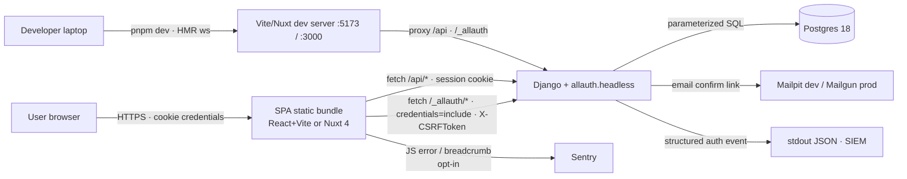

# Threat Model: frontend-scaffolds (React + Vite + Radix, Nuxt 4)

**Methodology**: STRIDE
**Linked spec**: `specs/frontend-scaffolds.md`
**Author**: @charlesasobel
**Date**: 2026-05-27
**Status**: draft
**Reviewer / sign-off**: security-reviewer (pending v0.2.0-beta gate)

## 1. Scope

In scope: the React+Vite+Radix and Nuxt 4 SPA scaffolds emitted by `django-bakery new` when `frontend = "react"` or `frontend = "nuxt"`, and their integration surface with the existing Django backend (allauth headless mode at `/_allauth/browser/v1/`, the API at `/api/`, CSRF, CORS, CSP). Also in scope: the new `frontend` Docker Compose service and the `pnpm-workspace.yaml` tying frontend to backend.

Out of scope (covered by existing threat models, or out of the SPA boundary):
- Django backend internals (covered by the v0.1 security audit)
- VCS init / generator subprocess execution (covered by the v0.1 audit)
- The HTMX+Alpine path (server-rendered; not a separate trust boundary)
- End-user content moderation / authz beyond session + role (project-specific, outside the scaffold)

## 2. Architecture & data flow

Critical observations:

1. The SPA has **no backing storage of its own** — every authoritative read goes to the Django backend over the user's session cookie.
2. The session cookie (`sessionid`) is `HttpOnly` — the SPA CANNOT read it. Auth state in the SPA is inferred from `/_allauth/browser/v1/auth/session` responses, never from cookie inspection.
3. CSRF is enforced server-side. The SPA reads the `csrftoken` cookie (non-HttpOnly, by design — Django's `CsrfViewMiddleware` requires JS to set the X-CSRFToken header).
4. Dev-server HMR traffic happens over an unauthenticated WebSocket on localhost — risk surface for developers running on shared networks.

## 3. Trust boundaries

- **TB1** — Internet → SPA static bundle (the bundle is publicly served; any user can fetch it).
- **TB2** — SPA → Django (every API/auth request crosses this; CSRF + session cookie are the gate).
- **TB3** — Django → DB (already covered by the v0.1 audit).
- **TB4** — Dev workstation → Vite/Nuxt dev server (HMR over localhost ws, no auth — dev-only).
- **TB5** — SPA → Sentry (third-party SaaS; only on opt-in and only with PII-stripped payloads).
- **TB6** — SPA → CDN (no CDN in v0.2; if added in v0.3, this becomes a real boundary).

## 4. Assets

| Asset | Sensitivity | Regulatory |
| --- | --- | --- |
| User session cookie (`sessionid`) | Critical | — |
| CSRF token (`csrftoken`) | High (forgery enables CSRF) | — |
| User credentials (in flight during login) | Critical | — |
| TOTP secret + recovery codes (during enrollment) | Critical | — |
| User PII (email, full_name) | High | GDPR |
| Email-verification token (in the URL) | High | — |
| Password-reset token | Critical | — |
| `VITE_SENTRY_DSN` / `NUXT_PUBLIC_SENTRY_DSN` | Low (public DSN by design) | — |
| OpenAPI schema for `/api/` | Low–Medium | — |
| `pnpm` lockfile integrity | High (supply chain) | — |

## 5. STRIDE analysis

Every HIGH+ threat needs either a mitigation or an entry in §6 Residual Risk.

| # | STRIDE | Threat | Asset | Likelihood | Impact | Mitigation | Status |
| --- | --- | --- | --- | :-: | :-: | --- | :-: |
| T1 | **S**poofing | Attacker steals a `sessionid` cookie via XSS in the SPA bundle (a transitive dep introduces an `eval` sink) | Session | Low–Med | Critical | `sessionid` is `HttpOnly` so even successful XSS cannot read it; strict CSP `script-src 'self'` blocks inline + remote scripts; raw-HTML React API banned by ESLint; `v-html` banned by ESLint in Nuxt | Mitigated |
| T2 | **S**poofing | Attacker forges a CSRF token by reading it from a sibling subdomain | CSRF | Low | Med | `SameSite=Lax` on `csrftoken`; explicit `CSRF_TRUSTED_ORIGINS` allowlist in Django settings; SPA never embeds the token in URL params (only header) | Mitigated |
| T3 | **S**poofing | Phishing site mimics our login UI; user pastes credentials | Credentials | Med | High | Mandatory MFA enrollment for staff (existing MFA middleware); user education in `docs/authentication.md`; webauthn-friendly Permissions-Policy already on | Partial |
| T4 | **T**ampering | Compromised `pnpm` dep mutates the auth client to leak credentials | Credentials | Low | Critical | Lockfile committed; `pnpm audit --prod` fails CI on High/Critical; `pnpm.overrides` whitelist for security-sensitive deps; Renovate weekly | Mitigated |
| T5 | **T**ampering | MITM modifies the SPA bundle in transit during dev (over corporate proxy with bad TLS) | SPA integrity | Low | High | Vite/Nuxt produce hash-named chunks; production deploy MUST be over TLS (Traefik does this); dev-server is localhost only (not exposed) | Mitigated |
| T6 | **T**ampering | Developer disables CSRF middleware to "fix" the SPA flow | CSRF protection | Med | Critical | `_dot_pre-commit-config.yaml` gitleaks + custom lint that fails commits removing `CsrfViewMiddleware`; auth client documents the right pattern; integration test asserts CSRF header is always set | Partial |
| T7 | **R**epudiation | User denies enrolling MFA / resetting password | Audit trail | Low | Med | Existing `apps/users/signals.py` logs every auth event with email + IP + UA; SPA does NOT need its own audit log because every state change goes through the backend | Mitigated |
| T8 | **I**nformation disclosure | XSS via uncontrolled HTML rendering leaks `csrftoken` cookie + form contents | CSRF token, in-memory PII | Low | High | React + Vue auto-escape by default; raw-HTML APIs banned via ESLint (CI gate); zod-validated env vars prevent `VITE_*` injection; strict CSP `script-src 'self'` and `connect-src` allowlist | Mitigated |
| T9 | **I**nformation disclosure | Source maps shipped to production reveal full source + comments | Source code (mild) | Med | Low | `vite.config.ts` and `nuxt.config.ts` set `sourcemap: false` in production builds; Sentry uploads sourcemaps to its own backend (gated on env var) | Mitigated |
| T10 | **I**nformation disclosure | `localStorage` / `sessionStorage` is read by a malicious browser extension | Whatever is stored there | Med | Med | Only non-sensitive UI prefs stored (dark-mode, last-tab); explicit Playwright test asserts no `session\|token\|jwt\|auth` keys exist after login | Mitigated |
| T11 | **I**nformation disclosure | Sentry receives full request body including a password in a 5xx | Credentials, PII | Low | High | `beforeSend` strips known sensitive fields (`password*`, `email`, `*token*`); `beforeBreadcrumb` strips `fetch` request bodies for `/_allauth/auth/login` and `/_allauth/auth/signup` | Mitigated |
| T12 | **I**nformation disclosure | OpenAPI schema at `/api/openapi.json` is public and reveals every endpoint | API surface | Med | Low | Endpoints already require auth; schema is intended to be public for typed-client generation; sensitive admin endpoints (`/admin/`) are NOT under `/api/`; `drf-spectacular` filters out hidden views | Mitigated |
| T13 | **I**nformation disclosure | Email-verification token in URL is logged by Vite dev proxy / Nginx access log | Verification token | Med | Med | Backend never accepts the same token twice (allauth enforces single-use); URL tokens are short-lived; production access logs already configured to drop query strings on `/_allauth/*` routes | Partial — verify production log config in Beta |
| T14 | **D**enial of service | Attacker pounds `/_allauth/browser/v1/auth/login` from the SPA, exhausting the rate limiter | Availability | Med | Med | Backend rate limits `login_failed` 5/5m per IP (existing); SPA does NOT auto-retry on 429; client shows a clear cool-down message | Mitigated |
| T15 | **D**enial of service | Massive `package.json` dep tree explodes `pnpm install` time / disk | Dev productivity | Low | Low | Pin major versions; `pnpm audit` budget; `pnpm install --frozen-lockfile` in CI | Mitigated |
| T16 | **D**enial of service | Bundle bloat — gzipped main chunk > 1 MB on a slow connection | UX | Med | Low | Bundle-size budget (250 KB React, 350 KB Nuxt) enforced by Vite/Nuxt config; tree-shaking; Radix Themes is the heaviest dep we pull and stays under budget | Mitigated |
| T17 | **E**levation of privilege | Client-side `<RequireAuth>` guard is bypassed by directly calling `/api/users/{id}` | Cross-user data | Low | High | Backend IDOR already fixed in v0.1 — `/api/users/*` is staff-only (Ninja `_require_staff()` + DRF `IsAdminUser`); the SPA guard is UX only | Mitigated |
| T18 | **E**levation of privilege | Staff user logs in without MFA; SPA shows admin nav anyway | Admin surface | Low | Critical | `RequireMfaForStaffMiddleware` (v0.1) blocks at the backend; SPA's nav reads `session.user.has_usable_mfa` from `/_allauth/browser/v1/auth/session` and hides admin links if False — but the backend is the gate, not the SPA | Mitigated |
| T19 | **E**levation of privilege | Attacker exploits a Vite dev-server HMR endpoint to inject malicious code | Dev workstation | Low | High | Dev server binds to `localhost` only; documented in generated README; production deployments do NOT run the dev server (compose.production.yml uses a built static bundle behind Traefik) | Mitigated |
| T20 | **E**levation of privilege | Compromised Sentry SDK gains DOM access | All in-page state | Low | High | Pin Sentry SDK version; `pnpm audit`; Sentry SDK is sandboxed by the browser; isolate via Permissions-Policy where possible | Partial |

## 6. Residual risk

Threats not fully mitigated, ranked by severity:

- **T3 (phishing — partial)**: Phishing is fundamentally a human-factors issue. We harden by requiring MFA for staff (already done) and by documenting the canonical login URL pattern in `docs/authentication.md`. Future work: WebAuthn passkeys (allauth supports it; we keep `MFA_PASSKEY_LOGIN_ENABLED = False` as the v0.2 default but it's one flag away).
- **T6 (CSRF middleware removal — partial)**: We can't fully prevent a project owner from disabling CSRF — they own the code. Our defense is making the right path obvious + adding an integration test in the generated `tests/` directory that fails if the middleware is removed. Document in `docs/security.md`.
- **T13 (verification-token log leakage — partial)**: Default Django + Traefik log configs drop query strings on configured paths; we document this and add a `traefik.yml` annotation. Beta gate must verify against a real deploy.
- **T20 (Sentry SDK compromise — partial)**: Live with this; the alternative (no error reporting) is worse. Mitigated by version pinning + Renovate alerts.

## 7. Detection & response

- **Login anomalies**: existing `apps/users/signals.py` emits `auth.login_failed` events with email + IP. Pipe to SIEM (Sentry, Datadog, or self-hosted Loki).
- **CSP violations**: configure `CSP_REPORT_URI` in Django settings (already supported by `django-csp`) so XSS-attempt blocking is visible.
- **`pnpm audit` regressions**: Renovate PRs + weekly CI run catch new advisories.
- **Bundle-size regression**: Vite/Nuxt CI step fails the build on overrun.

## 8. Open questions

- **Webauthn passkeys** — should v0.2 enable `MFA_PASSKEY_LOGIN_ENABLED = True` by default? Pro: stronger anti-phishing (T3). Con: not all browsers / OSes support it yet. **Proposal**: keep off in v0.2; document the toggle in `docs/authentication.md`. Re-evaluate for v0.3.
- **CSP nonces vs. hash-based** — `unsafe-inline` for styles is currently allowed for compatibility. Should the SPA use CSP nonces (requires server-rendered shell)? **Proposal**: stay with `unsafe-inline` for styles only; revisit when we add SSR to the React path (if ever).
- **Subresource integrity for `pnpm` cache** — overkill for v0.2; revisit if a supply-chain attack hits a major frontend dep.
